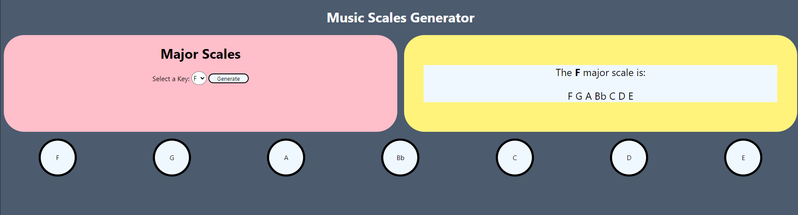

# The Music Theory Hub

### Author: Daniel Gaviria

## Description

This is a project that longs to be the music theory hub that amateurs and professionals alike could use. This idea will be updated on an ongoing basis where I intend to add interactivity for a better learning experience for children and adults that want to deepen their understanding of music theory and/or brush up on concepts that were long forgotten. This idea is at the inception stage so what you see right now could change in the next week.

I have not deployed this application but I intend to do it when it reaches a mature stage worthy of the attention of the public. If you would like to run this application in your local machine you could *clone* it and run `npm install`. 

## Technologies used

This application wants to grow to be a full stack application. For the time being I am using the following technologies:

+ NodeJS
+ Express
+ Web Audio API, Web Animations API, Web Midi API
+ Vanilla Javascript, CSS, HTML

I will be deciding which technologies/frameworks to use as this application grows but I intend to use *MongoDB* as the database and perhaps *Bootstrap* to enhace the looks and feel of the frontend. 

# License
## MIT License

Copyright (c) 2022 Daniel Gaviria

Permission is hereby granted, free of charge, to any person obtaining a copy
of this software and associated documentation files (the "Software"), to deal
in the Software without restriction, including without limitation the rights
to use, copy, modify, merge, publish, distribute, sublicense, and/or sell
copies of the Software, and to permit persons to whom the Software is
furnished to do so, subject to the following conditions:

The above copyright notice and this permission notice shall be included in all
copies or substantial portions of the Software.

THE SOFTWARE IS PROVIDED "AS IS", WITHOUT WARRANTY OF ANY KIND, EXPRESS OR
IMPLIED, INCLUDING BUT NOT LIMITED TO THE WARRANTIES OF MERCHANTABILITY,
FITNESS FOR A PARTICULAR PURPOSE AND NONINFRINGEMENT. IN NO EVENT SHALL THE
AUTHORS OR COPYRIGHT HOLDERS BE LIABLE FOR ANY CLAIM, DAMAGES OR OTHER
LIABILITY, WHETHER IN AN ACTION OF CONTRACT, TORT OR OTHERWISE, ARISING FROM,
OUT OF OR IN CONNECTION WITH THE SOFTWARE OR THE USE OR OTHER DEALINGS IN THE
SOFTWARE.
